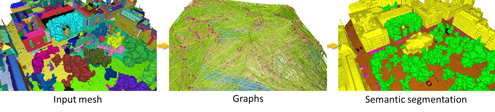

# PSSNet: **P**lanarity-sensible **S**emantic **S**egmentation of Large-scale Urban Meshes (Step-2)

This is part of the implementation of the paper: [*PSSNet: Planarity-sensible Semantic Segmentation of Large-scale Urban Meshes*](https://www.sciencedirect.com/science/article/pii/S0924271622003355). 
Specifically, it is used for *Step-2*: semantic classification. For *Step-1*: planarity-sensible over-segmentation, please refer to [*Step-1*](https://github.com/tudelft3d/SUMS-Semantic-Urban-Mesh-Segmentation-public/tree/pssnet) repository.   
It is based on the implementation of [*Large-scale Point Cloud Semantic Segmentation with Superpoint Graphs*](https://openaccess.thecvf.com/content_cvpr_2018/papers/Landrieu_Large-Scale_Point_Cloud_CVPR_2018_paper.pdf) by Loic Landrieu and Mohamed Boussaha (CVPR2019).
The original [SPG](https://github.com/loicland/superpoint_graph) is a PyTorch implementation for automatic semantic segmentation of large-scale point clouds.

<div align="center">    

</div>

## Citation

If you use it in a scientific work, we kindly ask you to cite it:

<div class="filteredelement"><strong>PSSNet: Planarity-sensible Semantic Segmentation of large-scale urban meshes</strong>. Weixiao Gao, Liangliang Nan, Bas Boom and Hugo Ledoux. <em> ISPRS Journal of Photogrammetry and Remote Sensing</em> 196 (2023) 32-44. <br/><a href="https://www.sciencedirect.com/science/article/pii/S0924271622003355"><i class="fas fa-external-link-alt"></i> PDF</a> <a href="#myref" data-toggle="collapse"><i class="fas fa-caret-square-down"></i> BibTeX</a> <div id="myref" class="collapse" tabindex="-1"><pre class="bibtex">@article{sum2021,
author = {Weixiao Gao and Liangliang Nan and Bas Boom and Hugo Ledoux},
title = {PSSNet: Planarity-sensible Semantic Segmentation of large-scale urban meshes},
journal = {ISPRS Journal of Photogrammetry and Remote Sensing},
volume = {196},
pages = {32-44},
year={2023},
issn = {0924-2716},
doi = {10.1016/j.isprsjprs.2022.12.020},
url = {https://www.sciencedirect.com/science/article/pii/S0924271622003355},
}
</pre></div></div>

## Code structure
* `./partition/*` - Partition code (convert mesh over-segmentation results and graphs to *.h5 format)
* `./learning/*` - Learning code (feature embedding and segment classification).

## Requirements 

*1.* Install [PyTorch](https://pytorch.org) and [torchnet](https://github.com/pytorch/tnt).
```
pip install git+https://github.com/pytorch/tnt.git@master
``` 

*2.* Install additional Python packages:
```
pip install future python-igraph tqdm transforms3d pynvrtc fastrlock cupy h5py sklearn plyfile scipy
```

*3.* Install Boost (1.63.0 or newer) and Eigen3, in Conda:<br>
```
conda install -c anaconda boost; conda install -c omnia eigen3; conda install eigen; conda install -c r libiconv
```

*4.* Compile the ```libpython_parsing``` libraries:
```
CONDAENV=YOUR_CONDA_ENVIRONMENT_LOCATION
cd segment_parsing_spg
mkdir build
cd build
cmake .. -DPYTHON_LIBRARY=$CONDAENV/lib/libpython3.7m.so -DPYTHON_INCLUDE_DIR=$CONDAENV/include/python3.7m -DBOOST_INCLUDEDIR=$CONDAENV/include -DEIGEN3_INCLUDE_DIR=$CONDAENV/include/eigen3
make
```
The code was tested on Ubuntu 16 with Python 3.7 and PyTorch 1.5.1.

## Running the code

#### Partition conversion
To convert mesh over-segmentation results and graphs to *.h5 format.
```
python partition/pssnet_partition.py --dataset custom_dataset --ROOT_PATH $CUSTOM_SET_DIR
``` 

#### Learning
To train the network.
```
CUDA_VISIBLE_DEVICES=0 python learning/pssnet_main.py --dataset custom_dataset --CUSTOM_SET_PATH $CUSTOM_SET_DIR --db_test_name testred --db_train_name trainval \
--epochs 200 --lr_steps '[50, 100, 150]' --test_nth_epoch 100 --model_config 'gru_10_1_1_1_0,f_6' --ptn_nfeat_stn 6 \
--nworkers 0 --pc_attrib xyzrgball --odir "../datasets/custom_set/results"
```

To perform the test.
```
CUDA_VISIBLE_DEVICES=0 python learning/pssnet_main.py --dataset custom_dataset --CUSTOM_SET_PATH $CUSTOM_SET_DIR --db_test_name testred --db_train_name trainval \
--epochs -1 --lr_steps '[50, 100, 150]' --test_nth_epoch 100 --model_config 'gru_10_1_1_1_0,f_6' --ptn_nfeat_stn 6 \
--nworkers 0 --pc_attrib xyzrgball --odir "../datasets/custom_set/results" --resume RESUME
```
#### Evaluation

To evaluate quantitatively a trained model: 
```
python learning/pssnet_evaluate.py --odir "../datasets/custom_set/results"
``` 

To write the predicted results, use the visualize function in partition. For example:
```
python partition/pssnet_visualize.py --dataset custom_dataset --ROOT_PATH $CUSTOM_SET_DIR --res_file "../datasets/custom_set/results/predictions_test" --output_type r
```

## License
PSSNet is free software; you can redistribute it and/or modify it under the terms of the 
GNU General Public License as published by the Free Software Foundation; either version 3
of the License or (at your option) any later version. The full text of the license can be
found in the accompanying 'License' file.

If you have any questions, comments, or suggestions, please contact me at <i>gaoweixiaocuhk@gmail.com</i>

[<b><i>Weixiao GAO</i></b>](https://3d.bk.tudelft.nl/weixiao/)

Feb. 2, 2023
