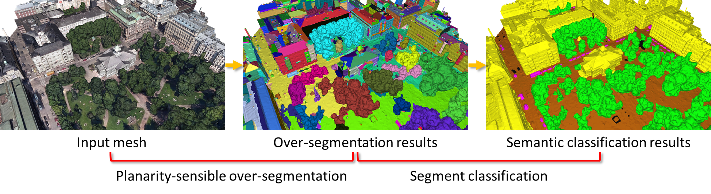

# PSSNet: **P**lanarity-sensible **S**emantic **S**egmentation of Large-scale Urban Meshes (Step-1).

This is the implementation of the paper: [*PSSNet: Planarity-sensible Semantic Segmentation of Large-scale Urban Meshes*](https://www.sciencedirect.com/science/article/pii/S0924271622003355). 
Specifically, it consists of two steps: *Step-1*: planarity-sensible over-segmentation; *Step-2*: semantic classification.   

<div align="center">    

</div>

## Citation

If you use it in a scientific work, we kindly ask you to cite it:

<div class="filteredelement"><strong>PSSNet: Planarity-sensible Semantic Segmentation of large-scale urban meshes</strong>. Weixiao Gao, Liangliang Nan, Bas Boom and Hugo Ledoux. <em> ISPRS Journal of Photogrammetry and Remote Sensing</em> 196 (2023) 32-44. <br/><a href="https://www.sciencedirect.com/science/article/pii/S0924271622003355"><i class="fas fa-external-link-alt"></i> PDF</a> <a href="#myref" data-toggle="collapse"><i class="fas fa-caret-square-down"></i> BibTeX</a> <div id="myref" class="collapse" tabindex="-1"><pre class="bibtex">@article{sum2021,
author = {Weixiao Gao and Liangliang Nan and Bas Boom and Hugo Ledoux},
title = {PSSNet: Planarity-sensible Semantic Segmentation of large-scale urban meshes},
journal = {ISPRS Journal of Photogrammetry and Remote Sensing},
volume = {196},
pages = {32-44},
year={2023},
issn = {0924-2716},
doi = {10.1016/j.isprsjprs.2022.12.020},
url = {https://www.sciencedirect.com/science/article/pii/S0924271622003355},
}
</pre></div></div>

## Usage
Please refer to the ```README.md``` in the folder for the different steps.

## License
PSSNet is free software; you can redistribute it and/or modify it under the terms of the 
GNU General Public License as published by the Free Software Foundation; either version 3
of the License or (at your option) any later version. The full text of the license can be
found in the accompanying 'License' file.

If you have any questions, comments, or suggestions, please contact me at <i>gaoweixiaocuhk@gmail.com</i>

[<b><i>Weixiao GAO</i></b>](https://3d.bk.tudelft.nl/weixiao/)

Feb. 2, 2023
